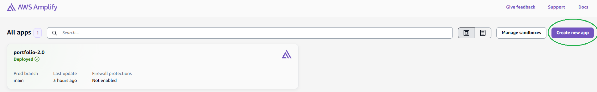
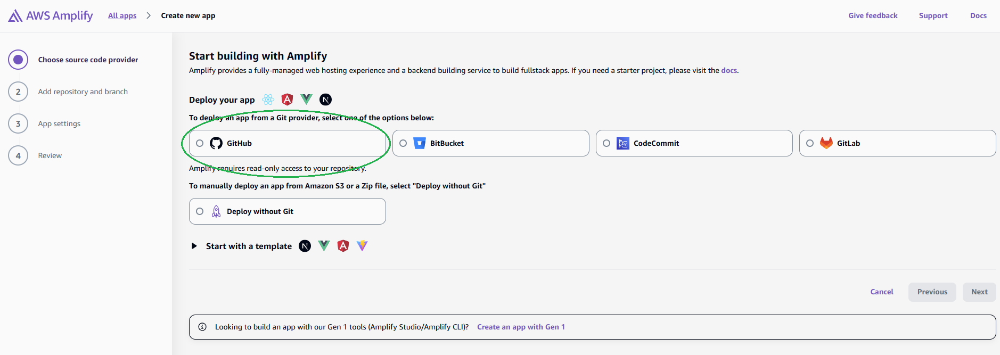
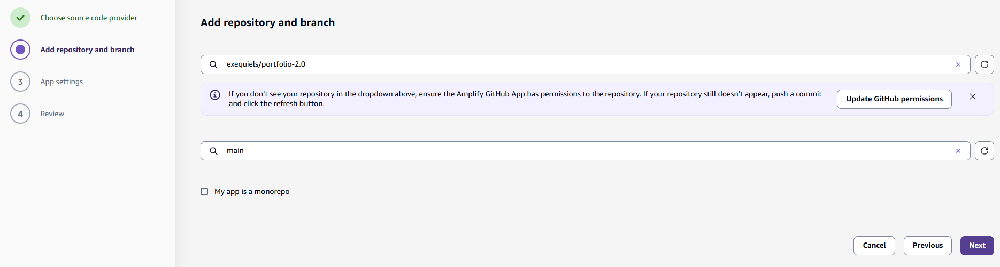
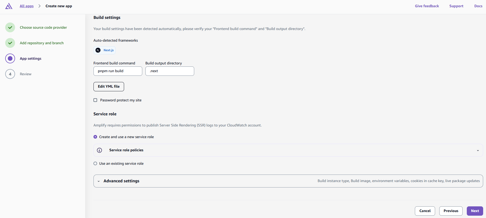
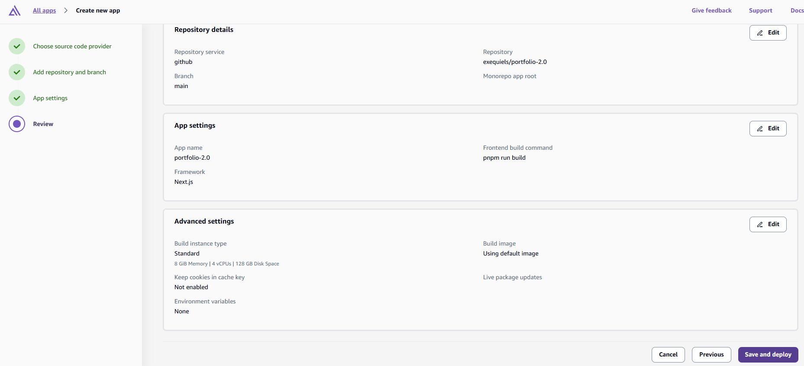
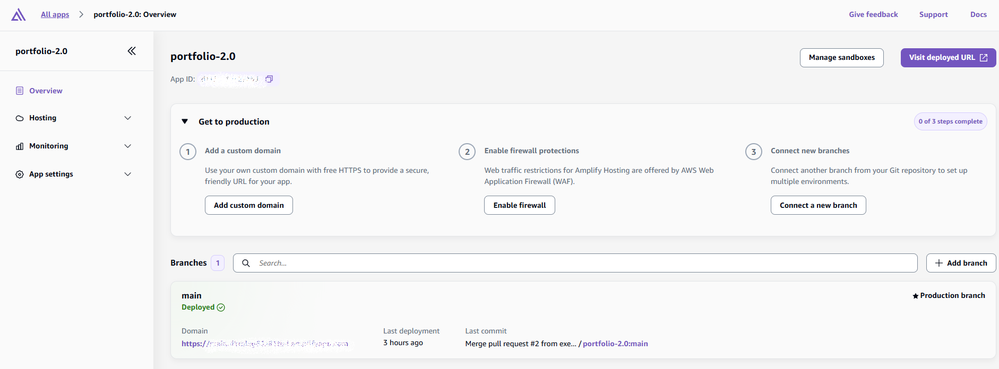

Visit my portfolio-2.0 at https://www.sabatie.com.ar/

## Overview

This repository contains my personal portfolio-2.0, built as a modern web application and enhanced with an **AI mediator agent** that explains my experience, projects, and technical decisions.

The goal is to reduce friction between my actual work and how it is presented.

---

## AI Mediator Agent – Role Fit Evaluation

The AI mediator agent is designed to simulate an initial screening step between a recruiter and my profile.

Instead of free-form Q&A, the interaction is structured through:

- Work mode selection: **Remote / Hybrid / On-site**
- Technology stack selection via dropdown
- A job description input where the recruiter is asked to provide:
  - A short description of the project, work environment, team setup, working hours, salary range, and any other relevant details.

Based on this input, the mediator performs an objective compatibility analysis against my technical background, experience, certifications, and documented projects.

### Mediator Response Structure

When the provided job description is valid and sufficiently detailed, the mediator returns a structured evaluation consisting of:

1. **Compatibility Score**  
   A percentage (0–100%) representing how well the role requirements align with my profile.

2. **Justification (4–6 lines)**  
   An explanation of the score.

3. **Risks or Red Flags**  
   Missing or weaker requirements are identified transparently.

4. **Mismatch Management**  
   Clear acknowledgment of mismatches.

5. **Final Verdict (Conditional Logic)**  
   The conclusion is generated dynamically based on the score.

---

## Deployment Challenge & Technical Decision

During deployment, I initially evaluated **AWS Amplify**, since I work with AWS and cloud infrastructure on a daily basis.

However, for this specific project I encountered limitations related to:

- Free tier DNS restrictions when pointing to a custom domain (Hostinger)

Since this is a personal profile and not a production-scale system, I decided to avoid unnecessary infrastructure complexity and $$$.

### Solution

I migrated the project to **Vercel**, which provided:

- Native Next.js support (builds, routing, SSR)
- Preview environments
- DNS configuration fully supported in the free tier

This decision alloweds me to gain experience since I actually did the deployment to AWS Amplify and create my own Document for future projects, and save money.

## What I've learned and tested

- How to set up an deploy in AWS Amplify, Free tier limitations.
- How to deploy a projects to Vercel for quick projects view.
- What Zod is(validation library), if I need a more solid validation process it's nice to know about it.
- What Redis is(High speed db storage) so In a near future I can implement a quick Database for lets say rate limit users IP or sorting for example.
- remark-gfm: Added support for GitHub Flavored Markdown features like tables, task lists, and autolinks.
- rehype-raw: Enabled the parsing and rendering of raw HTML elements embedded within Markdown content.
- rehype-sanitize: Secured the application by stripping dangerous code (XSS protection) from rendered HTML.
- Tailwind Typography: Applied the prose class to automatically style raw HTML/Markdown.

## For My Future Self

**Quick Amplify Create App**

- 1. Create App
     We writte Amplify in the AWS console, and search for the Create APP button to start.
     
- 2. Choose a source code provider.
     For this case I've used GitHub
     
- 3. Set up Permissions and branch.
     We set permissions to the repo and branch we are going to be listening for changes.
     
- 4. App settings.
     From here we can edit our YML if needed, it's autogenerated with basic options, we click the create role so aws automaticly creates a role to manage this. Using the Advance Settings lets us add **ENVIROMENT VARIABLES** also change the instance type, etc.
     
- 5. Review
     Last step review and hit save to deploy, if we encounter any errors we can later check logs from the Sidebard everything is there.
     

Checking our deployed App

- Overeview
  We can check our deployed App, visit the generated url, etc. We can also set a domain using Route53 or our hosting preference, I tried to set it up to www.sabatie.com.ar creating a CNAME record in my Hostinguer so I could keep emails since i'ts a cheap service but FreeTier has i'ts limitations so thats why we moved to Vercel. To configure this in Vercel is quite similar.
  

---

<!-- PORTFOLIO_DATA_START
**Stack:** Next.js 16, React 19, TypeScript, Tailwind CSS, PrimeReact, Google Gemini API
**Description:** Personal portfolio with an AI mediator agent that explains my experience, projects and certifications.
**What I've learned and tested:**
- How to set up an deploy in AWS Amplify, Free tier limitations.
- How to deploy a projects to Vercel for quick projects view.
- What Zod is(validation library), if I need a more solid validation process it's nice to know about it.
- What Redis is(High speed db storage) so In a near future I can implement a quick Database for lets say rate limit users IP or sorting for example.
- remark-gfm: Added support for GitHub Flavored Markdown features like tables, task lists, and autolinks.
- rehype-raw: Enabled the parsing and rendering of raw HTML elements embedded within Markdown content.
- rehype-sanitize: Secured the application by stripping dangerous code (XSS protection) from rendered HTML.
- Tailwind Typography: Applied the prose class to automatically style raw HTML/Markdown with professional layouts.
**Highlights:**
- AI mediator agent powered by Gemini API
- Type-safe AI responses using TypeScript interfaces
- Markdown rendering with react-markdown (GFM + sanitization)
- Component-based architecture with Next.js App Router
- UI built with Tailwind CSS + PrimeReact
- README-driven knowledge extraction for AI context
PORTFOLIO_DATA_END -->
